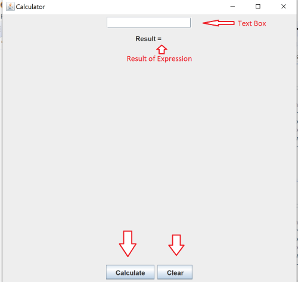

# Working-Calculator

This program implements a calculator which takes in positive and negative doubles and operands and then evaluates and displays the result.

## The operators supported by the calculator are:
- for addition ' + '
- for subtraction ' - '
- for multiplication ' * '
- for division ' / '
- for parenthesis ' ( ' ' ) '

## Link To Code
[Code](src)

## Features
- Text Box 
-- Type Expression
- Calculate Button
- Clear Button
- Result Label
### Calculator Display

